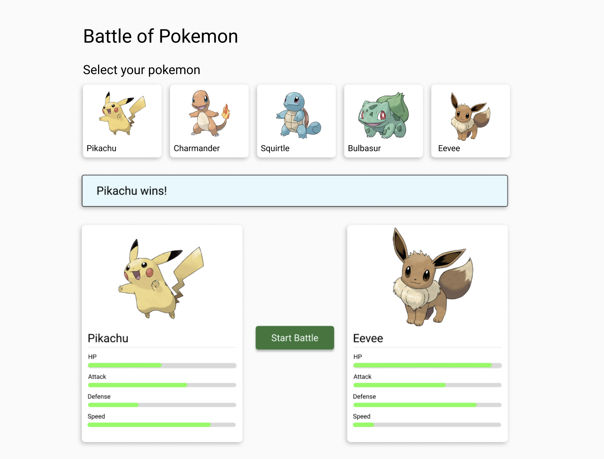

# Pokemon Batalla

La aplicación es una batalla de Pokémon. Cada uno tiene diferentes stats, como ataque y defensa, por ejemplo, 
y tenemos que hacerlos batallar entre ellos.

## Objetivos de Backend

1. Implementar migraciones de DB, debe de popularse una tabla con los datos de los pokemon
2. Implementar endpoint para listar todos los pokemon
3. Implementar endpoint para hacerlos batallar
4. Guardar los resultados de las batallas en una tabla

## Objetivos del Frontend

1. Implementar la UI/UX que liste y seleccione los pokemon
2. Implementar la Card del Pokemon que liste los stats
3. Cuando de Inicio a la batalla, se debe escoger automáticamente y aleatoriamente un contrincante diferente y luego mostrar el resultado
4. Implementar Responsividad básica.
5. Conectar con el Backend

## Visual


## Algoritmo de Batalla

Para el cálculo de la batalla, ten en consideración lo siguiente:

- El pokemon con la velocidad más alta hace el primer ataque, si son iguales, el pokemon con el ataque más alto va primero.
- Para calcular el daño, resta la defensa del ataque (ataque-defensa). La diferencia es el daño. Si el ataque es igual o menor que la defensa el daño es 1.
- El daño lo restas del HP.
- Los pokemon pelearán por turnos. Todos los turnos serán calculados in el mismo request. Es por esto por lo que el endpoint debe retornar la data del ganador en la misma llamada.
- El ganador es el que se reste el HP del enemigo a cero. 
- NOTA: como adicional se podría implementar el sistema de tipos, pero no es requerido.

## Tecnología a usar

Backend:
- [Nest](https://github.com/nestjs/nest) 
- [Typeorm](https://typeorm.io/)
- [Sqlite](https://www.sqlite.org/)

Frontend:
- [React](https://legacy.reactjs.org/)
- [MaterialUI](https://mui.com/material-ui/)

## Configuración del proyecto Local 

### Configuración del proyecto backend

```bash
$ cd backend
$ npm install
```

### Configuración del proyecto frontend

```bash
$ cd frontend
$ npm install
```

### Compilar y ejecutar el proyecto

```bash
$ cd backend
$ npm run start:dev
```

```bash
$ cd frontend
$ npm start
```

## Configuración del proyecto Docker

```bash
$ docker compose up --build
```

## License

Nest is [MIT licensed](https://github.com/nestjs/nest/blob/master/LICENSE).
